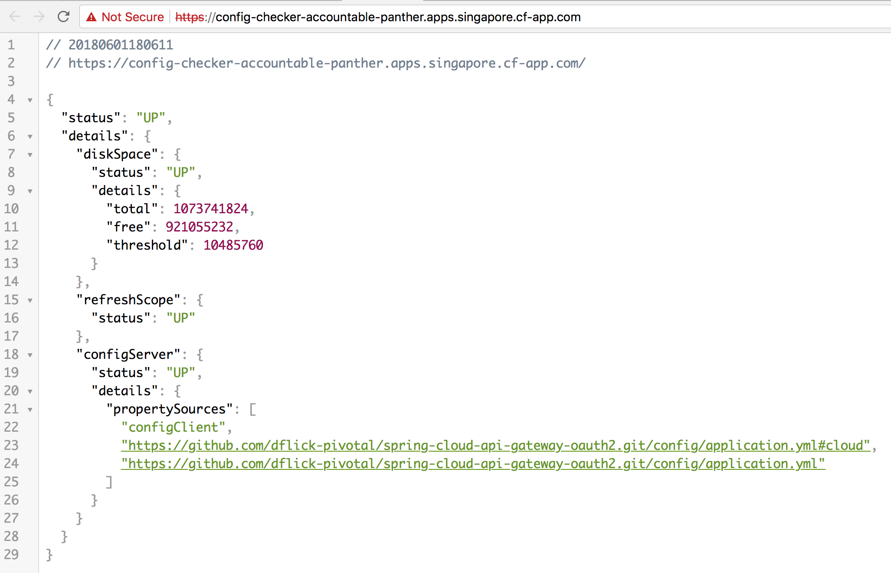
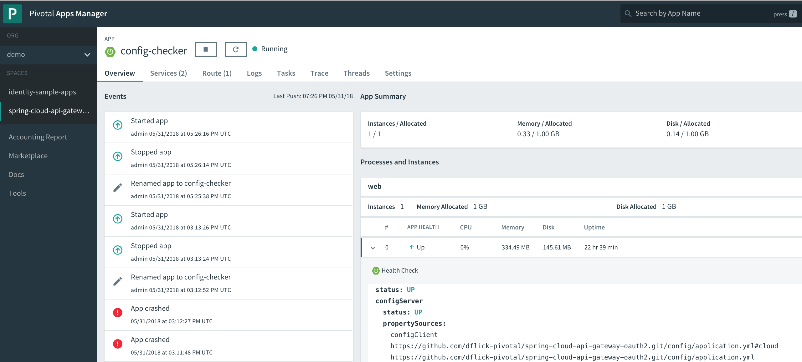
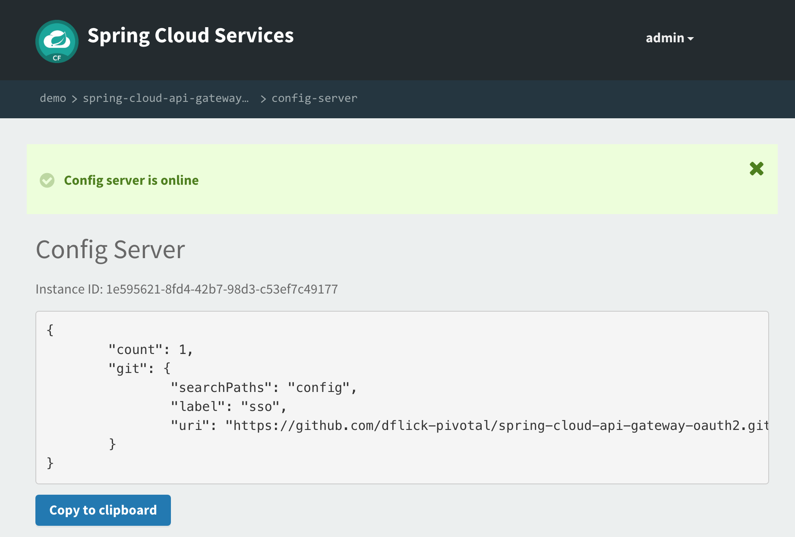

# config-checker

config-checker is a example applications demonstrating the use of Spring Cloud Service Registry, the integration of Spring Boot Actuator in Apps Manager and with this to quickly check config-checker is able to gather configurations from Spring Cloud Config Server instances for Pivotal Cloud Foundry. (For information on the Config Server product, please see [the documentation](https://docs.pivotal.io/spring-cloud-services/1-5/common/index.html).)

## Building and Deploying

Build the project from the root (```config-checker```) directory:

```
$ ./mvnw package
```
Create a Config Server instances or use any already existing Config Server Instance.

Your PAS instance needs internet access for the following.
If you do not have internet access from PAS use a existing Config Server instance.

```
cf cs p-config-server standard config-server -c '{"git": { "uri": "https://github.com/dflick-pivotal/spring-cloud-api-gateway-oauth2.git", "searchPaths": "config", "label": "sso" } }'
```

Set the `TRUST_CERTS` environment variable in the [manifest.yml](manifest.yml) to the API endpoint of your Elastic Runtime instance (as in `api.example.com`).

```
applications:
- name: registry-checker
  disk_quota: 1G
  instances: 1
  memory: 1G
  random-route: true
  path: target/registry-checker-boot-1x-0.0.1-SNAPSHOT.jar
  services:
  - config-server
  env:
    TRUST_CERTS: api.example.com
```

*Setting `TRUST_CERTS` causes Spring Cloud Services to add the the SSL certificate at the specfied API endpoint to the JVM's truststore, so that the client application can communicate with a Config Server service instance even if your Elastic Runtime instance is using a self-signed SSL certificate (see the [Service Registry documentation](http://docs.pivotal.io/spring-cloud-services/service-registry/writing-client-applications.html#self-signed-ssl-certificate)).*

Push the applications

```
cf push
```

## Trying It Out

Visit the application home page. The home page provides the response from Spring Boot Actuator "actuator/health" endpoint. Here you can see if the app successfully connected to the Config Server and was able to gather its configuration.



Visit Apps Manager and find the Spring Boot Actuator integration. The overview tab provides the response from Spring Boot Actuator "actuator/health" endpoint. Here you can see if the app successfully connected to the Config Server.



Visit Management Dashboard of the Config Server instance bound with the app. Here you can see if Config Server successfully cloned Configurations from the repository.



For more information about the Config Server and its use in a client application, see the [Config Server documentation](http://docs.pivotal.io/spring-cloud-services/config-server/writing-client-applications.html).
